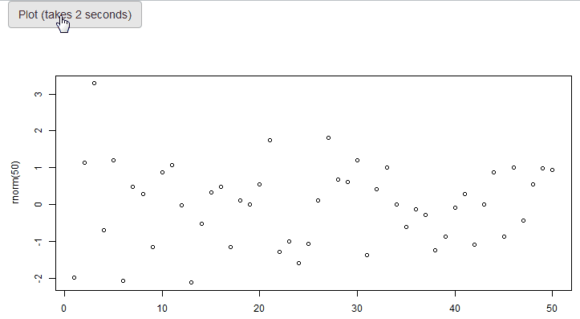
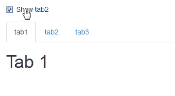
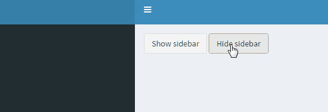
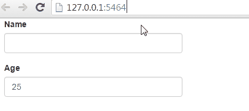
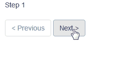
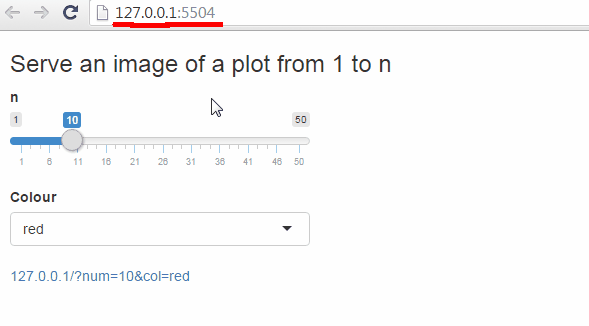
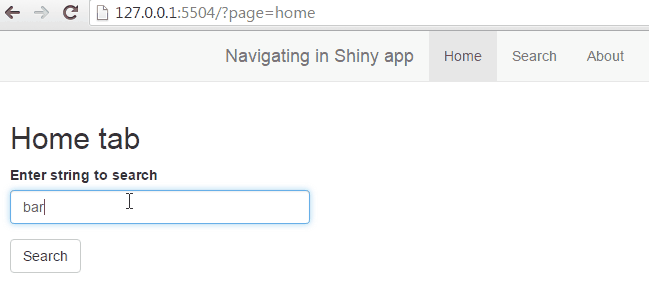

TODO dropdown with groups

```
  selectInput("country", "Select country", list(
    "Europe" = c("Germany", "Spain"),
    "North America" = c("Canada", "United States" = "USA")
  ))
```

# Shiny tips 'n tricks for common issues and for improved user experience

> *Copyright 2016 [Dean Attali](http://deanattali.com). Licensed under the MIT license.*

shinyjs (reset inputs, disable, hide), global.R

### Table of contents

- [Show a spinning "loading" animation while a plot is recalculating](#plot-spinner) ([code](./plot-spinner))
- [Hide a tab](#hide-tab) ([code](./hide-tab))
- [Hide/show shinydashboard sidebar programmatically](#shinydashboard-sidebar-hide) ([code](./shinydashboard-sidebar-hide))
- [Loading screen](#loading-screen) ([code](./loading-screen))
- [Automatically stop a Shiny app when closing the browser tab](#auto-kill-app) ([code](./auto-kill-app))
- [Close the window (and stop the app) with a button click](#close-window) ([code](./close-window))
- [Select input with more breathing room](#select-input-large) ([code](./select-input-large))
- [Pre-populate Shiny inputs when an app loads based on URL parameters](#url-inputs) ([code](./url-inputs))
- [Split app code across multiple files (when codebase is large)](#split-code) ([code](./split-code))
- [Use a variable from the server in a UI `conditionalPanel()`](#server-to-ui-variable) ([code](./server-to-ui-variable))
- [Show user a generic error message when a Shiny error occurs in an output](#error-custom-message) ([code](./error-custom-message))
- [Fix filenames of files uploaded via fileInput()](#upload-file-names) ([code](./upload-file-names))
- [Shiny app with sequence of pages](#multiple-pages) ([code](./multiple-pages))
- [Toggle a UI element (alternate between show/hide) with a button](#simple-toggle) ([code](./simple-toggle))
- [Send a message from R to JavaScript](#message-r-to-javascript) ([code](./message-r-to-javascript))
- [Send a message from JavaScript to R](#message-javascript-to-r) ([code](./message-javascript-to-r))))
- [Send a message from JavaScript to R - force repetitive messages to get sent](#message-javascript-to-r-force) ([code](./message-javascript-to-r-force))))
- [Press the Enter key to simulate a button press](#proxy-click) ([code](./proxy-click))
- [Serve files (images/text files/etc) instead of webpages from a Shiny app](#serve-images-files) ([code](./serve-images-files))
- [Update multiple Shiny inputs without knowing input type](#update-input) ([code](./update-input))
- ["Busy..." / "Done!" / "Error" feedback after pressing a button](#busy-indicator) ([code](./busy-indicator))
- [Simple AJAX system for Shiny apps (JS -> R -> JS communication)](#api-ajax) ([code](./api-ajax))
- [Navigation in a Shiny app (forward/backwards in history)](#navigate-history) ([code](./navigate-history))
- [Sharing images on Facebook](#fb-share-img) ([code](./fb-share-img))
- [Facebook login through JavaScript in Shiny](#fb-login) ([code](./fb-login))
- [Multiple scrollspy on same page - basic](#multiple-scrollspy-basic) ([code](./multiple-scrollspy-basic))
- [Multiple scrollspy on same page - advanced](#multiple-scrollspy-advanced) ([code](./multiple-scrollspy-advanced))


<h2 id="plot-spinner">Show a spinning "loading" animation while a plot is recalculating</h2>

**[Link to code](./plot-spinner)**

When a Shiny plot is recalculating, the plot gets grayed out. This app shows how you can add a spinner wheel on top of the plot while it is recalculating, to make it clear to the user that the plot is reloading. There can be many different ways to achieve a similar result using different combinations of HTML/CSS, this example is just the simplest one I came up with.

[](./plot-spinner)


<h2 id="hide-tab">Hide a tab</h2>

**[Link to code](./hide-tab)**

This app demonstrates how `shinyjs` can be used to hide/show a specific tab in a `tabsetPanel`.  In order to use this trick, the `tabsetPanel` must have an id. Using this id and the value of the specific tab you want to hide/show, you can call `shinyjs::hide()`/`shinyjs::show()`/`shinyjs::toggle()`.

[](./hide-tab)

<h2 id="shinydashboard-sidebar-hide">Hide/show shinydashboard sidebar programmatically</h2>

**[Link to code](./shinydashboard-sidebar-hide)**

A common question regarding `shinydashboard` is how to programmatically hide/show the sidebar. This can very easily be done using the [shinyjs](https://github.com/daattali/shinyjs) package, as demonstrated here.

[](./shinydashboard-sidebar-hide)

<h2 id="loading-screen">Loading screen</h2>

**[Link to code](./loading-screen)**

This simple app shows how to add a "Loading..." screen overlaying the main app while the app's server is initializing.  The main idea is to include an overlay element that covers the entire app (using CSS), hide the main app's UI, and at the end of the server function show the UI and hide the overlay.

[](./loading-screen)

<h2 id="auto-kill-app">Automatically stop a Shiny app when closing the browser tab</h2>

**[Link to code](./auto-kill-app)**

When developing a Shiny app and running the app in the browser (as opposed to inside the RStudio Viewer), it can be annoying that when you close the browser window, the app is still running and you need to manually press "Esc" to kill it. By adding a single line to the server code `session$onSessionEnded(stopApp)`, a Shiny app will automatically stop running whenever the browser tab (or any session) is closed.

<h2 id="close-window">Close the window (and stop the app) with a button click</h2>

**[Link to code](./close-window)**

This simple example shows how you can have a button that, when clicked, will close the current browser tab and stop the running Shiny app (you can choose to do only one of these two actions).

<h2 id="select-input-large">Select input with more breathing room</h2>

**[Link to code](./select-input-large)**

One common CSS question in Shiny is how to make the select input dropdown menu have some more whitespace.  It's actually very easy to do with just two CSS rules, as demonstrated in this example.

[](./select-input-large)

<h2 id="url-inputs">Pre-populate Shiny inputs when an app loads based on URL parameters</h2>

**[Link to code](./url-inputs)**

This simple app demonstrates how you can fill out certain input fields when a Shiny app loads based on URL parameters.

[](./url-inputs)

<h2 id="split-code">Split app code across multiple files (when codebase is large)</h2>

**[Link to code](./split-code)**

When creating Shiny apps with a lot of code and a complex UI, it can sometimes get very messy and difficult to maintain your code when it's all in one file. What you can do instead is have one "main" UI and "main" server and split your UI and server code into multiple files. This can make your code much more manageable and easier to develop when it grows large. You can split the code however you want, but I usually like to split it logically: for example, if my app has 4 tabs then the UI for each tab would be in its own file and the server code for each tab would be in its own file. The example code here shows how to separate the code of an app with two tabs into 2 UI files and 2 server files (one for each tab).


<h2 id="server-to-ui-variable">Use a variable from the server in a UI `conditionalPanel()`</h2>

**[Link to code](./server-to-ui-variable)**

When using a conditional panel in the UI, the condition is usually an expression that uses an input value. But what happens when you want to use a conditional panel with a more complex condition that is not necessarily directly related to an input field? This example shows how to define an output variable in the server code that you can use in the UI. An alternative approach is to use the `show()` and `hide()` functions from the [shinyjs](https://github.com/daattali/shinyjs) package.


<h2 id="error-custom-message">Show user a generic error message when a Shiny error occurs in an output</h2>

**[Link to code](./error-custom-message)**

When a Shiny output encounters an error, the exact error message will be shown to the user in place of the output. This is generally a good feature because it's easier to debug when you know the exact error. But sometimes this is undesireable if you want to keep the specifics of what happened unknown to the user, and you prefer to just show the user a generic "Some error occurred; please contact us" message. This may sound counter intuitive, but you can actually do this with a tiny bit of CSS, as this example shows.


<h2 id="upload-file-names">Fix filenames of files uploaded via fileInput()</h2>

**[Link to code](./upload-file-names)**

When selecting files using a `fileInput()`, the filenames of the selected files are not retained. This is not usually a problem because usually you only care about the contents of a file and not its name. But sometimes you may actually need to know the original name of each selected file. This example shows how to write a simple function `fixUploadedFilesNames()` to rename uploaded files back to their original names.


<h2 id="multiple-pages">Shiny app with sequence of pages</h2>

**[Link to code](./multiple-pages)**

This app demonstrates how to write a Shiny app that has a sequence of different pages, where the user can navigate to the next/previous page. This can be useful in many scenarios that involve a multi-step process. This behaviour can also be achieved by simply using tabs, but when using tabs the user can freely move from any tab to any other tab, while this approach restricts the user to only move to the previous/next step, and can also control when the user can move on to the next page.

[](./multiple-pages)

<h2 id="simple-toggle">Toggle a UI element (alternate between show/hide) with a button</h2>

**[Link to code](./simple-toggle)**

Sometimes you want to toggle a section of the UI every time a button is clicked. This app shows how to achieve very basic toggle functionality using `conditionalPanel()`. If you want anything more advanced, you can use the `toggle()` function from the [shinyjs](https://github.com/daattali/shinyjs) package.

<h2 id="message-r-to-javascript">Send a message from R to JavaScript</h2>

**[Link to code](./message-r-to-javascript)**

While Shiny is very powerful, there are many things that cannot be achieved in R and must be done in JavaScript. When including JavaScript code in a Shiny app, you sometimes need to send a message or a value from R to the JavaScript layer. This example how this is done.

<h2 id="message-javascript-r">Send a message from JavaScript to R</h2>

**[Link to code](./message-javascript-to-r)**

In some shiny applications you may want to send a value from JavaScript to the R server. This can be useful in a variety of applications, for example if you want to capture a mouse click or a keyboard press of the user and tell R about it. This example shows how this is done.

<h2 id="message-javascript-r-force">Send a message from JavaScript to R - force repetitive messages to get sent</h2>

**[Link to code](./message-javascript-to-r-force)**

TODO

<h2 id="proxy-click">Press the Enter key to simulate a button press</h2>

**[Link to code](./proxy-click)**

This is a simple app with a tiny bit of JavaScript that shows you how to cause an Enter key press inside an input to trigger a click on a button.

<h2 id="serve-images-files">Serve files (images/text files/etc) instead of webpages from a Shiny app </h2>

**[Link to code](./serve-images-files)**

It is possible to serve an image or another file directly from your Shiny app instead of a webpage.  The method shown here is a simple proof-of-concept of how to achieve this functionality.  It also supports passing GET parameters to the file-generating logic so that the file can be parameterized.

[](./serve-images-files)

<h2 id="update-input">Update multiple Shiny inputs without knowing input type </h2>

**[Link to code](./update-input)**

Shiny allows you to update an input element only if you know the type of input. Furthermore, Shiny only allows you to update input elements one by one.  This Shiny app shows how you can update an input only using its ID and without knowing its type, and how to update multiple inputs together.

<h2 id="busy-indicator">"Busy..." / "Done!" / "Error" feedback after pressing a button</h2>

**[Link to code](./busy-indicator)**

When the user clicks on a button, it usually results in some R code being run. Sometimes the resulting code is short and quick and the user doesn't even notice any delay, but sometimes the button click initialiates some long process or computation that can take more than 1 second to complete. In those cases, it might be a bit confusing to the user if there is no immediate feedback notifying that the action is being performed. For example, if the user clicked a button to load data from a database and it takes 3 seconds to connect to the database, it can be useful to show a "Connecting..." and then a "Done!" (or "Error") message, instead of just letting the user wait without seeing any message. Of course when the wait time is only 2-3 seconds it's not a big deal, but you can imagine that for a 20-second process, the user might think that something went wrong if there is no feedback. This example shows how to add some immediate feedback to the user after a button is clicked, including disabling/enabling the button and showing a success/error message when appropriate.

[](./busy-indicator)

<h2 id="api-ajax">Simple AJAX system for Shiny apps (JS -> R -> JS communication)</h2>

**[Link to code](./api-ajax)**

Sometimes it's useful to be able to call an R function from JavaScript and use the return value from R back in JavaScript. This sort of communication is usually done with AJAX in JavaScript. This app shows how to implement a simple and ultra lightweight AJAX-like system in Shiny, to be able to call functions in R.

<h2 id="navigate-history">Navigation in a Shiny app (forward/backwards in history)</h2>

**[Link to code](./navigate-history)**

Sometimes it's nice to be able to support navigation within a Shiny app, especially when there are multiple tabs or some other form of "multiple pages" in a Shiny app. Since Shiny apps are a single page, the browser nagivation buttons (previous/next page) don't work when "navigating" within a Shiny app. You also can't bookmark a certain "page" in a Shiny app - every time you go to an app, you will be shown the initial state of the app. This app shows how to implement basic navigation in Shiny apps.

[](./navigate-history)

<h2 id="fb-share-img">Sharing images on Facebook</h2>

**[Link to code](./fb-share-img)**

There are two ways to share images on Facebook: either using an image URL and a popup dialog, or by programmatically supplying the Facebook API with a base64 encoded image. This example shows both.

<h2 id="fb-login">Facebook login through JavaScript in Shiny</h2>

**[Link to code](./fb-login)**

This app shows how you can use the [AJAX-like system](./api-ajax) in Shiny to authorize a user using Facebook's JavaScript library and pass the user's information to R for processing.

<h2 id="multiple-scrollspy-basic">Multiple scrollspy on same page - basic</h2>

**[Link to code](./multiple-scrollspy-basic)**

The Bootstrap *scrollspy* plugin does not support multiple scrollspy objects per page. This Shiny app demonstrates how to support scrollspy on multiple tabs by having one common scrollspy control that gets updated via JavaScript whenever a tab is changed to reflect the contents of the new tab.

<h2 id="multiple-scrollspy-advanced">Multiple scrollspy on same page - advanced</h2>

**[Link to code](./multiple-scrollspy-advanced)**

The Bootstrap *scrollspy* plugin does not support multiple scrollspy objects per page.
This Shiny app demonstrates how to support scrollspy on multiple tabs by allowing each tab to have its own independent scrollspy control and using JavaScript to ensure only the scrollspy on the current tab is activated.


