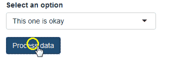

# "Busy..." / "Done!" / "Error" feedback after pressing a button 

When the user clicks on a button, it usually results in some R code being run. Sometimes the resulting code is short and quick and the user doesn't even notice any delay, but sometimes the button click initialiates some long process or computation that can take more than 1 second to complete. In those cases, it might be a bit confusing to the user if there is no immediate feedback notifying that the action is being performed. For example, if the user clicked a button to load data from a database and it takes 3 seconds to connect to the database, it can be useful to show a "Connecting..." and then a "Done!" (or "Error") message, instead of just letting the user wait without seeing any message. Of course when the wait time is only 2-3 seconds it's not a big deal, but you can imagine that for a 20-second process, the user might think that something went wrong if there is no feedback.

This example shows how to add some immediate feedback to the user after a button is clicked: the button gets disabled, a "loading" icon appears, when the action completes the button gets re-enabled and a checkmark icon appears shortly. If an error occurs, an error icon and message appear. The code here is a little bit more involved than the other examples, but it is not complicated if you go through it line by line. I made the code generalize easily and all the code you need to copy to your app is inside the [helpers.R](./helpers.R) file. Look at the [app.R](./app.R) file to see how to use it in an app - it's very easy.

Note that I wrote this code before Shiny modules existed, but it can probably be re-written to work as a module. This exercise is left to the reader if you feel so inclined :)

[See a real shiny app where I used this concept](http://daattali.com/shiny/ddpcr/)

---

