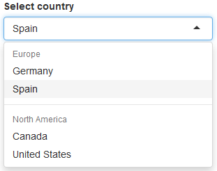

# Select input with groupings of options

This isn't really a trick as much as an [undocumented feature](https://github.com/rstudio/shiny/issues/1321) in Shiny that not many people know about. Usually when people write dropdowns in Shiny, all the options are just provided as one long list. But it is possible to have groups of items, and it's very easy to do, for example:

```
selectInput("country", "Select country", list(
  "Europe" = c("Germany", "Spain"),
  "North America" = c("Canada", "United States" = "USA")
))
```

---

[](./dropdown-groups.png)