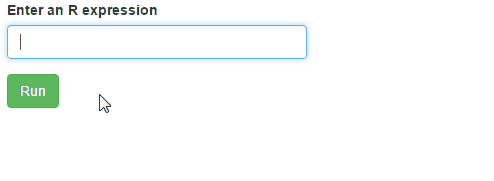

# Run arbitrary code live in Shiny - great for testing during development

**NOTE: This is now part of the `shinyjs` package. All you need to achieve the results below is to run two functions in your shiny app - look at the documentation for `?shinyjs::runcode`.** 

When I develop Shiny apps or packages for Shiny, I often find myself wanting to be able to run R code on-demand while the app is running. Outside of Shiny, in regular R programming, we have the R console where we can run any command at any point in time, but in Shiny we don't really have that.  So while developing, I often add a text input that lets me type any R code into it and then run it. This is very useful for testing.

**WARNING:** Do not provide this in a Shiny app that anyone else can access. This should be **strictly used for testing locally**. Having other people run arbitrary code in your app is asking for trouble.

---

