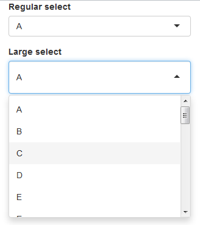

# Select input with more breathing room

One common CSS question in Shiny is how to make the select input dropdown menu have some more whitespace.  It's actually very easy to do with just two CSS rules, as demonstrated in this example.

[See a real shiny app where I used this concept](http://daattali.com/shiny/shinyjs-demo/)

---

